# Krime — AI Agent 桌面客户端架构方案概要

> Krime（霜）：跨平台 AI Agent 桌面客户端，支持多模型，让 AI 真正动手完成任务。

## 技术栈

- **前端**：Svelte 5 + TypeScript + Vite（包体最小，性能最优）
- **UI 组件**：shadcn-svelte + `marked` + `highlight.js`（Markdown/代码渲染）
- **桌面壳**：Tauri 2.x（Tauri IPC，无 axum 服务层）
- **后端（Rust）**：`reqwest`（HTTP + 代理）、`tokio`（异步）、`sqlx`（SQLite）、`rmcp 1.2.0`（MCP 客户端）、`tree-sitter`（代码分析，Phase 3）
- **密钥存储**：`tauri-plugin-stronghold`（加密存储 API Key，底层使用 IOTA Stronghold）

---

## 方案摘要

- **版本**：v0.3
- **目标版本**：优先指导 Phase 1 / Phase 2 实现
- **目标读者**：项目作者、未来协作者、实现前端/后端模块的开发者
- **核心结论**：
  - Agent 运行循环放在 Rust，前端仅负责控制与展示
  - 运行时状态采用事件化持久化，而不是仅依赖聊天消息
  - 权限控制基于结构化能力边界，而不是原始命令字符串白名单
  - Phase 1 先做单项目、单会话、单 run 串行执行，优先把运行时骨架打稳

## 目标与非目标

### 目标

- 做一个本地优先、跨平台的 AI Agent 桌面客户端
- 支持多 Provider、多项目、多会话的统一运行体验
- 让模型可以安全地读写工作区、执行命令、调用 MCP 工具
- 让用户看见 Agent 的运行过程，包括 tool call、确认、输出、文件变更
- 为后续的长会话、恢复执行、代码索引、多窗口打下稳定基础

### 非目标

- 不内置完整代码编辑器；代码编辑由工具完成，UI 只展示结果
- Phase 1 不做并行多 run 调度，不做复杂任务队列系统
- Phase 1 不做云同步、多人协作、远程托管工作区
- Phase 1 不做语义检索、向量数据库和高级代码库问答
- 不追求兼容所有模型厂商的全部高级特性，先统一核心 chat/tool 能力

## 核心架构决策

- **本地优先**：工作区、会话、运行状态、规则和密钥默认保存在本机
- **Rust 为运行时真相源**：run 生命周期、审批、工具执行、取消在 Rust 统一管理
- **前端为投影层**：前端只消费事件和提交命令，不持有唯一运行状态
- **事件化持久化**：聊天消息用于对话展示；run/tool/approval/file_change 用于恢复与审计
- **能力边界优先于易用性**：默认保守批准，支持细粒度放行，不做字符串级白名单信任
- **Phase 1 优先串行稳定性**：先保证单 run 正确，再考虑并发、多模型混用和后台任务

---

## 核心定位

一个运行在本地的 **AI Agent 指挥中枢**，用户通过自然语言下达指令，Agent 调用工具自主完成任务。

**核心场景：编程开发**

- 读取项目结构、理解代码、编写和修改代码文件
- 执行构建、测试、部署命令
- 不需要实现编辑器，代码的编写与修改在后台完成，UI 只展示过程和结果

**扩展场景：通用任务自动化**

- 文件/目录整理（批量重命名、归类、清理）
- 邮件、文档处理（配合 MCP 扩展）
- 信息抓取、数据整理、定期任务自动化
- 任何可以通过 Shell 命令或 MCP 完成的工作

```
用户下达指令
  → Agent 理解意图，制定执行计划
  → 调用工具（读写文件 / 执行命令 / 抓取网页 / MCP 扩展）
  → 界面实时展示工具调用过程和结果（危险操作需用户确认）
  → 用户确认或继续对话
```

---

## 项目与工作区模型

参考 Codex 的项目模型：

- **一个项目 = 一个工作目录**
- 创建项目时指定或新建一个目录，该目录即为此项目的工作区
- 也可以直接打开已有目录作为项目
- 项目下的所有会话共享同一个工作区目录
- Agent 的文件操作默认限定在工作区目录内

**Git 感知**：项目打开时自动向上查找 `.git`，如果当前工作区在 Git 仓库内，则启用 Git 感知能力：

```rust
struct WorkspaceContext {
    root: PathBuf,
    git_root: Option<PathBuf>,
    git_branch: Option<String>,
    git_dirty_files: Option<Vec<PathBuf>>,
    gitignore: Option<GlobSet>,  // ignore crate 解析
}
```

Git 感知带来的能力：

- `fs_list` 自动排除 `.gitignore` 中的文件，减少无效 token
- `fs_write` 后可基于 `git diff` 生成更精确的变更展示
- 环境上下文注入时告知模型当前 branch、dirty files 等信息
- 为后续 apply_patch、rollback 操作预留基础

```
项目列表
├── project-a/          ← 工作区目录
│   ├── 会话 1
│   ├── 会话 2
│   └── 会话 3（已归档）
└── project-b/          ← 工作区目录（已归档）
    └── 会话 1
```

---

## 整体架构

```mermaid
flowchart TD
    subgraph frontend [前端 Svelte 5]
        ProjectList[项目列表]
        SessionTabs[会话 Tab 多窗口]
        ChatUI[对话界面\n消息流 / 工具调用状态]
        FileTree[文件树\n只读，实时更新]
        DiffView[文件变更视图\n只读 diff]
        TerminalOut[终端输出\n流式展示]
        TokenCounter[上下文用量统计]
        ConfirmDialog[操作确认对话框]
        RunController[会话控制\n启动 / 取消 / 批准]
    end

    subgraph tauri_core [Tauri IPC 边界]
        Commands[Tauri Commands]
        Events[Tauri Events\n流式输出 / 文件变更通知]
    end

    subgraph rust_backend [后端 Rust]
        AgentRuntime[Agent Runtime\n运行循环 / 状态机]
        ProviderMgr[Provider Manager\n统一 chat 接口]
        ProxyMgr[Proxy Manager\n按 Provider 独立配置]
        ToolExec[Tool Executor]
        PolicyMgr[Capability Policy\n命令 / 文件 / 网络边界]
        ConfirmMgr[Confirmation Manager\n危险操作拦截]
        ContextMgr[Context Manager\n上下文压缩]
        RunStore[Run Store\nrun / tool_call / artifact]
        RulesLoader[Rules Loader\n规则 / Skills 加载]
        CodeAnalyzer[Code Analyzer\ntree-sitter 符号提取]
        FileWatcher[File Watcher\n监听工作区变更]
        MCPMgr[MCP Server Manager]
        KeyStore[Key Store\nStronghold 加密]
        DB[SQLite\n项目 / 会话 / 消息 / 配置]
    end

    subgraph tools [内置工具]
        ShellExec[shell_exec\n执行命令，流式输出]
        FSReadWrite[fs_read / fs_write\n文件读写]
        Search[grep / glob\n搜索文件内容与路径]
        WebFetch[web_fetch\n抓取网页转 Markdown]
        CodeRun[code_run\n运行 Python/Node 等]
        RulesWrite[rules_write\n更新规则文件]
    end

    subgraph external [外部]
        OpenAI[OpenAI]
        Anthropic[Anthropic]
        Gemini[Google Gemini]
        Ollama[Ollama 本地模型]
        MCPServer[MCP Servers\nstdio / HTTP+SSE]
    end

    RunController -->|start / cancel / approve| Commands
    Commands --> AgentRuntime
    Commands --> RunStore
    AgentRuntime --> ProviderMgr
    AgentRuntime --> ToolExec
    AgentRuntime --> ConfirmMgr
    AgentRuntime --> ContextMgr
    AgentRuntime --> RulesLoader
    AgentRuntime --> CodeAnalyzer
    AgentRuntime --> MCPMgr
    ProviderMgr --> ProxyMgr
    ProviderMgr --> KeyStore
    ProxyMgr -->|reqwest| OpenAI
    ProxyMgr -->|reqwest| Anthropic
    ProxyMgr -->|reqwest| Gemini
    ProxyMgr -->|直连| Ollama
    ToolExec --> PolicyMgr
    ToolExec --> ConfirmMgr
    ToolExec --> ShellExec
    ToolExec --> FSReadWrite
    ToolExec --> Search
    ToolExec --> WebFetch
    ToolExec --> CodeRun
    ToolExec --> RulesWrite
    AgentRuntime --> RunStore
    ConfirmMgr -->|需要确认| Events
    Events -->|确认请求| ConfirmDialog
    MCPMgr -->|stdio/SSE| MCPServer
    FileWatcher -->|notify| Events
    Events -->|流式 token / 文件变更| frontend
    RunStore <--> DB
    DB <--> Commands
```




---

## 核心抽象与接口

本节定义 Phase 1 必须先稳定下来的核心接口；具体实现可以调整，但语义应保持一致。

### 1. Provider 抽象

```rust
type ChatEventStream = Pin<Box<dyn Stream<Item = ProviderEvent> + Send>>;

struct ChatRequest {
    messages: Vec<ModelMessage>,
    tools: Vec<ToolSpec>,
    params: ModelParams,
}

trait Provider: Send + Sync {
    fn metadata(&self) -> ProviderMetadata;

    async fn chat_stream(
        &self,
        request: ChatRequest,
    ) -> Result<ChatEventStream, ProviderError>;
}
```

Provider 输出归一化为 `ProviderEvent`：

```rust
enum ProviderEvent {
    TextDelta(String),
    ReasoningSummaryDelta(String),
    ReasoningContent {
        encrypted: Option<String>,
        summary: String,
    },
    ToolCallStart { id: String, name: String },
    ToolCallArgsDelta { id: String, delta: String },
    ToolCallDone { id: String },
    Done,
    Error(ProviderError),
}
```

说明：

- `ReasoningSummaryDelta` / `ReasoningContent`：对支持推理链的模型（o3/o4/Claude extended thinking），流式输出推理摘要；`encrypted` 字段为模型服务端返回的加密推理内容，原样传回可用于后续推理，但客户端不可解读
- UI 层可选择展示或折叠 reasoning summary，提升 Agent 行为的可观测性

约束：

- Provider 只负责模型协议适配，不直接感知 UI、DB 和审批逻辑
- 工具 schema 在进入 Provider 前已标准化
- Provider 输出统一归一化为 `ProviderEvent`

### 2. Tool 抽象

```rust
struct ToolCall {
    id: String,
    name: String,
    args_json: serde_json::Value,
}

trait Tool: Send + Sync {
    fn spec(&self) -> ToolSpec;

    async fn invoke(
        &self,
        ctx: ToolContext,
        call: ToolCall,
    ) -> Result<ToolResult, ToolError>;
}
```

约束：

- Tool 不直接弹 UI，不直接写前端状态
- 所有副作用操作先经过 `PolicyMgr` 和 `ConfirmMgr`
- ToolResult 必须可序列化并可写入 `tool_events` / `artifacts`

### 3. Run 状态机

```rust
enum RunStatus {
    Queued,
    Running,
    WaitingApproval,
    Completed,
    Failed,
    Cancelled,
}
```

状态迁移：

```text
Queued -> Running
Running -> WaitingApproval
WaitingApproval -> Running
Running -> Completed
Running -> Failed
Queued/Running/WaitingApproval -> Cancelled
```

约束：

- 同一会话在 Phase 1 只允许一个活动 run
- `WaitingApproval` 时模型流必须暂停，不允许继续生成下一步工具调用
- `Cancelled` 必须是终态；取消后不得继续写入新的工具执行结果

### 4. Tauri Command / Event 契约

前端到后端命令：

```rust
start_run(conv_id, user_input, provider_id, model, params) -> run_id
approve_action(run_id, approval_id, decision) -> ()
cancel_run(run_id) -> ()
load_run(run_id) -> RunSnapshot
list_conversation_runs(conv_id) -> Vec<RunSummary>
```

后端到前端事件：

```rust
RunCreated
RunStatusChanged
AssistantDelta
ReasoningDelta          // 推理摘要流式输出，UI 可折叠展示
ToolCallStarted
ToolCallUpdated
PlanUpdated             // update_plan 工具触发，展示任务计划变更
ApprovalRequested
ApprovalResolved
TerminalOutput
FileChanged
RunCompleted
RunFailed
```

要求：

- 所有事件带 `run_id`
- 同类事件带单调递增 `seq`
- 前端可仅通过快照 + 增量事件恢复完整展示

### 5. 文件编辑契约

```rust
struct FileWriteRequest {
    path: PathBuf,
    content: String,
    preimage_hash: Option<String>,
}
```

语义：

- `preimage_hash = None`：明确表示允许无前镜像保护的写入，仅用于创建文件或用户确认后的兜底写入
- `preimage_hash = Some(...)`：写入前校验当前文件哈希，不匹配则返回冲突
- Phase 1 可先不做 patch 级编辑，但接口必须兼容后续 `apply_patch`
- 后续 `apply_patch` 实现时采用精确匹配 + 模糊回退策略：先以 `old_string` 做精确字符串匹配定位替换位置，失败后尝试忽略空白差异的模糊匹配（模型生成的代码片段常有缩进/空白偏差），都失败才返回 mismatch 错误

### 6. 失败处理原则

- Provider 流中断：标记当前 run 为 `Failed`，保留已产生事件，不自动重跑
- Tool 超时：记录为 tool error，由模型决定是否重试
- 审批超时：run 保持 `WaitingApproval`，由用户显式恢复或取消
- 应用重启：前端通过 `load_run` 恢复未完成 run 的展示状态
- 连续失败上下文漂移缓解：工具连续失败 2 次及以上时，在下一轮 prompt 中重新注入原始任务摘要，防止错误输出（堆栈跟踪、重试噪音）累积导致模型偏离原始目标

```rust
fn on_tool_failure(&mut self, error: &ToolError) {
    self.consecutive_failures += 1;
    if self.consecutive_failures >= 2 {
        self.inject_task_reminder(&self.original_user_input);
    }
}

fn on_tool_success(&mut self) {
    self.consecutive_failures = 0;
}
```

---

## 核心模块详解

### 1. 多 Provider 适配层（Rust）

统一 trait，各 Provider 各自实现：

```rust
type ChatEventStream = Pin<Box<dyn Stream<Item = ProviderEvent> + Send>>;

trait Provider: Send + Sync {
    fn metadata(&self) -> ProviderMetadata;

    async fn chat_stream(
        &self,
        request: ChatRequest,
    ) -> Result<ChatEventStream, ProviderError>;
}
```

实现：`OpenAIProvider`、`AnthropicProvider`、`GeminiProvider`、`OllamaProvider`

每个 Provider 持有独立的 `reqwest::Client`，构造时注入代理配置，API Key 从 Stronghold 读取。

### 2. 模型参数配置

每个 Provider 或每个会话均可独立配置：

```rust
struct ModelParams {
    temperature: Option<f32>,     // 默认由模型决定
    max_tokens: Option<u32>,
    top_p: Option<f32>,
    // 其他模型支持的参数...
}
```

配置优先级：会话级参数 > Provider 默认参数 > 模型默认值。

### 3. 代理管理（Rust）

每个 Provider 独立配置，互不影响：

```rust
struct ProxyConfig {
    proxy_type: Option<ProxyType>,  // None=直连 | Http | Socks5
    url: Option<String>,            // "http://127.0.0.1:7890"
}
```

Ollama 本地模型默认直连，云端模型可独立指定代理。

### 4. Agent 执行循环（Rust Runtime）

```
用户输入（前端发起 start_run）
  → Rust AgentRuntime 创建 run
  → 加载规则上下文（全局 rules + 项目规则 + skills）
  → 注入沙箱权限描述（当前能力边界的结构化说明，让模型知道自己能做什么）
  → 注入工作区上下文
      Phase 1~2：基础文件树结构
      Phase 3+： 文件树 + tree-sitter 符号索引（精准截取相关代码块）
  → 注入环境上下文（cwd / shell / os / git branch / dirty files）
  → 检查上下文用量，必要时压缩旧消息
  → 收集可用工具（内置工具 + Skills + MCP 暴露的工具，按固定顺序排列；MCP 工具数量超过阈值时启用懒加载）
  → 绑定本次 run 的能力边界（命令 / 文件 / 网络）
  → 调用模型（stream）
  → 解析 tool_call / reasoning，写入 tool_call 记录
  → 危险操作 → 触发确认机制 → 挂起 run，等待用户批准
  → 分发执行（Tauri command）
  → 返回 tool_result
  → 继续调用模型
  → 持续写入 tool_event / artifact / file_change
  → 直到模型返回 final message，run 完成
```

环境上下文结构：

```rust
struct EnvironmentContext {
    cwd: PathBuf,
    shell: String,           // zsh / bash / powershell
    os: String,              // darwin / linux / windows
    arch: String,            // aarch64-apple-darwin / x86_64-unknown-linux-gnu
    git_branch: Option<String>,
    git_dirty_files: Option<Vec<String>>,
}
```

每次构建 prompt 时以结构化格式注入：

```xml
<environment_context>
  <cwd>/Users/me/project</cwd>
  <shell>zsh</shell>
  <os>darwin</os>
  <git_branch>main</git_branch>
  <git_dirty_files>src/lib.rs, README.md</git_dirty_files>
</environment_context>
```

环境上下文对模型生成正确命令至关重要（macOS vs Linux 差异、路径格式、包管理器选择等）。

前端 Svelte store 只镜像运行状态，不持有唯一真相；窗口刷新后可根据 `run / tool_call / tool_event` 记录恢复展示。

取消语义由 Rust runtime 统一处理：模型流、工具执行和待确认状态共享同一个 cancellation token。

Run 生命周期建议持久化如下：

```rust
struct RunSnapshot {
    run: RunRecord,
    pending_approvals: Vec<ApprovalRecord>,
    tool_calls: Vec<ToolCallRecord>,
    recent_events: Vec<RunEvent>,
}
```

Phase 1 采用单 run 串行模型：

- 每个 `conversation` 同时最多 1 个 `Running | WaitingApproval` run
- 同一 run 内 tool_call 按顺序执行
- 不在 Phase 1 支持并行 tool_call、嵌套 run 或子 agent

### 5. 内置工具（Rust）


| 工具            | 实现                    | 阶段      | 说明                                                                |
| ------------- | --------------------- | ------- | ----------------------------------------------------------------- |
| `shell_exec`  | `tauri-plugin-shell`  | Phase 1 | 执行结构化命令（`program + args + cwd`），流式返回 stdout/stderr                |
| `fs_read`     | `tauri-plugin-fs`     | Phase 1 | 读取文件内容，限定在工作区目录内                                                  |
| `fs_write`    | `tauri-plugin-fs`     | Phase 1 | 写入文件时附带 `preimage_hash`，支持冲突检测；MVP 可先落为整文件写入                      |
| `fs_list`     | `tauri-plugin-fs`     | Phase 1 | 列出目录结构                                                            |
| `grep`        | `grep` crate (ripgrep) | Phase 1 | 按正则搜索文件内容，只读操作无需审批；支持 glob 过滤、行数上限，输出结构化匹配结果                     |
| `glob`        | `glob` crate          | Phase 1 | 按路径模式查找文件，只读操作无需审批；返回匹配文件列表，按修改时间排序                              |
| `update_plan` | 内存 + 事件               | Phase 1 | 模型主动更新任务计划，无副作用，无需审批；写入 RunState 并推送 `PlanUpdated` 事件，UI 实时展示任务进度 |
| `rules_write` | `tauri-plugin-fs`     | Phase 1 | 更新项目 `.krime/AGENTS.md`（用户要求时由 AI 写入）                             |
| `code_run`    | 调用 `shell_exec`       | Phase 2 | 运行 Python/Node/Deno 等脚本，默认需确认                                     |
| `web_fetch`   | `reqwest` + `scraper` | Phase 2 | 抓取网页，转 Markdown                                                   |


### 6. Agent 操作确认机制

**默认行为**：所有会产生副作用的系统操作（Shell 命令执行、文件写入、代码运行、工作区外访问）均需用户确认。

确认机制不再基于原始命令字符串，而是基于结构化能力描述：

```rust
struct CommandPolicy {
    program: String,
    args: Vec<String>,
    cwd: PathBuf,
    env_mode: EnvMode,         // inherit_filtered | empty | allowlist
    network: NetworkPolicy,    // deny | allow
    fs_scope: FsScope,         // workspace_ro | workspace_rw | outside_workspace
}
```

**可配置项**（设置页）：

- `auto_approve: bool`：仅对显式允许的安全策略自动批准，不覆盖工作区外访问
- `allow_rules: Vec<CommandPolicyRule>`：基于 `program + args + cwd + network + fs_scope` 的结构化规则
- `env_allowlist: Vec<String>`：允许传递给子进程的环境变量白名单

**确认 UI**：

```
┌─────────────────────────────────────┐
│  Agent 请求执行以下操作：             │
│                                     │
│  shell_exec                         │
│  program: npm                       │
│  args: ["run", "build"]             │
│  cwd: /workspace                    │
│                                     │
│  [拒绝]           [批准]             │
└─────────────────────────────────────┘
```

安全边界：

- `shell_exec` 默认固定 `cwd` 为当前项目工作区，不允许静默切到工作区外执行
- 工作区外的文件读写、删除、执行脚本、开启网络访问 **强制确认**，不受 `auto_approve` 影响
- 原始字符串白名单不作为信任依据，避免 `;`、重定向、shell expansion、alias 等绕过方式

**权限描述注入 Prompt**：沙箱权限不仅在运行时拦截，还以 developer message 写入 prompt，让模型提前知道自己的能力边界，避免生成必然被拒绝的操作：

```xml
<permissions>
  <sandbox>workspace_write</sandbox>
  <writable_dirs>/Users/me/project</writable_dirs>
  <network>deny</network>
  <approval_policy>
    需要用户批准的操作：shell 命令执行、文件写入、工作区外访问。
    自动批准的操作：文件读取、目录列表、update_plan。
  </approval_policy>
</permissions>
```

权限描述在会话开始时生成一次，会话中途如果用户修改确认策略，以追加新消息的方式更新（不修改已有消息，保护 Prompt Cache 命中率）。

### 7. 上下文管理与压缩

当会话 token 用量接近模型上限（默认阈值 80%）时，自动触发压缩：

```
保留：system prompt + 最近 N 条消息（完整保留）
压缩：早期消息 → 调用模型生成摘要 → 以 summary 消息替换
```

压缩策略：

- 压缩摘要只服务于模型上下文，不作为运行时唯一状态来源
- 摘要落库时保留 `is_summary = true`，对外发送给不同 Provider 时映射为兼容的 system/developer 上下文片段，而不是依赖非标准 `role`
- UI 中用折叠方式展示已压缩的历史段
- 压缩不删除数据库中的原始消息，仅影响发送给模型的上下文

**Prompt Caching 友好设计**：

主流 Provider（OpenAI、Anthropic）支持基于精确前缀匹配的 Prompt Caching，命中缓存可将推理延迟和成本降低数倍。核心原则：**静态在前、动态在后；追加而非修改**。

具体措施：

- prompt 分层排列严格遵循从最稳定到最易变的顺序（见"会话 system prompt 构建顺序"）
- 每次新请求的 prompt 是上一次请求的精确前缀 + 新增内容
- 工具列表按固定顺序排列（内置工具 → MCP 工具，各组内按名称排序）
- 中途配置变更（沙箱策略、cwd 等）以追加新消息的方式反映，**不修改已有消息**

可能导致缓存失效的操作（需谨慎处理）：

- 中途改变可用工具列表（MCP server 动态增删工具）
- 切换目标模型（model-specific instructions 会改变）
- 修改 instructions 内容

**配置变更的追加策略**：

```rust
fn on_config_changed(&mut self, change: ConfigChange) {
    match change {
        ConfigChange::SandboxPolicy(new_policy) => {
            // 追加新的 developer message，不修改早期的权限描述
            self.append_developer_msg(&format_sandbox_description(&new_policy));
        }
        ConfigChange::WorkingDirectory(new_cwd) => {
            // 追加新的 user message，不修改早期的环境上下文
            self.append_user_msg(&format_environment_context(&new_cwd));
        }
    }
}
```

运行时状态与自然语言历史分离维护：

```rust
struct RunState {
    pending_approvals: Vec<ApprovalRef>,
    latest_tool_results: Vec<ToolResultDigest>,
    recent_file_changes: Vec<FileChangeRef>,
    todo_state: Vec<TodoItem>,
}
```

即使早期聊天消息被压缩，`pending approvals`、最近工具结果、文件变更和 Todo 进度仍完整保留，避免长会话失忆。

### 8. 代码分析（tree-sitter，Level 2，Phase 3）

- 解析代码为 AST，提取函数、类、变量等符号
- Agent 按符号定位代码块，避免将整个文件喂给模型（节省 token）
- 支持语言：Python、TypeScript/JavaScript、Rust、Go、Java 等
- 项目打开时异步建立符号索引，文件变更时增量更新

### 9. MCP 集成（Rust）

- 使用 `rmcp 1.2.0` 实现 MCP Client
- 支持 stdio transport（本地进程）和 HTTP+SSE transport（远程）
- 每个 MCP server 独立配置：`enabled`、`auto_start`、`timeout_ms`、`max_concurrency`
- 为每个 MCP server 标记 `trust_level`（`local_trusted` / `local_untrusted` / `remote`）
- 工具名按 `server_name.tool_name` 命名空间暴露，避免多 server 同名冲突
- 是否允许访问当前工作区、是否允许自启动、是否默认显示给模型，均按 server 单独控制
- **工具列表排序稳定性**：内置工具按固定顺序排列，MCP 工具按 `server_name.tool_name` 字典序排列。如果 MCP server 通过 `notifications/tools/list_changed` 动态变更工具列表，延迟到当前 turn 结束后再更新，避免 mid-turn prompt 前缀变化导致缓存失效
- **工具懒加载**：当注册的 MCP 工具总数超过阈值（默认 20）时，不一次性将所有工具定义注入 prompt（大量工具定义可能消耗数万 tokens），改为只注入一个 `tool_search` 元工具；模型通过 `tool_search` 按关键词查找所需工具，命中后再将具体工具定义动态注入当前 turn。工具数量低于阈值时仍全量加载

建议配置结构：

```rust
struct McpServerConfig {
    name: String,
    transport: McpTransport,
    auto_start: bool,
    trust_level: TrustLevel,
    timeout_ms: u64,
    max_concurrency: u32,
    expose_to_model: bool,
    workspace_access: WorkspaceAccess,
}
```

### 10. UI 展示模块（前端，无编辑器）


| 模块        | 阶段      | 说明                                     |
| --------- | ------- | -------------------------------------- |
| 项目列表      | Phase 1 | 创建/打开项目（选择目录），记录最近项目，支持归档              |
| 会话 Tab    | Phase 2 | 每个项目下多个会话，独立上下文，支持归档                   |
| 对话消息流     | Phase 1 | 用户消息 + AI 回复 + 工具调用块（可折叠）              |
| 工具调用状态    | Phase 1 | 每个 tool_call 展示：工具名 / 参数 / 执行状态 / 结果摘要 |
| 操作确认对话框   | Phase 1 | 危险操作前弹出确认，展示命令/操作详情                    |
| 文件变更视图    | Phase 1 | `fs_write` 后展示只读 diff（修改前后对比）          |
| 终端输出面板    | Phase 2 | `shell_exec` 的实时 stdout/stderr 流       |
| 文件树面板     | Phase 2 | 当前工作区目录结构，实时监听更新，只读                    |
| 会话搜索      | Phase 2 | 跨会话全文搜索消息内容，SQLite FTS5 实现             |
| Token 进度条 | Phase 2 | 当前会话上下文用量 / 模型上限，压缩触发提示                |


---

## 规则、Skills 与记忆

### 设计原则

- **Rules**：人工定义的指令/规范，会话开始前加载注入 system prompt
- **Skills**：可复用的任务模板，用户或 AI 触发执行
- **记忆**：不设独立记忆模块。AI 在用户明确要求时，通过 `rules_write` 工具更新 `.krime/AGENTS.md`，由用户完全掌控持久化内容

### 全局配置目录

```
~/.krime/
├── rules/             ← 全局规则（人工维护，所有项目自动加载）
│   ├── coding.md
│   ├── git.md
│   └── *.md
├── skills/            ← 全局 Skills（所有项目可用）
│   ├── new-api.md
│   └── write-tests.md
├── config.yaml        ← Provider / 代理 / 确认机制等全局配置
└── krime.db           ← SQLite 数据库
```

### 项目级规则（首个匹配即停止）

按以下优先级从高到低探测，**找到第一个存在的即加载，后续不再读取**：

```
1. .krime/AGENTS.md          ← Krime 专属项目规则（最高优先级）
2. .krime/rules/*.md         ← Krime 专属规则目录
3. AGENTS.md                 ← 兼容 Codex / Goose
4. .cursor/rules/*.md        ← 兼容 Cursor 项目规则
5. .claude/CLAUDE.md         ← 兼容 Claude Code（最低优先级）
```

### 项目级 Skills（按优先级合并加载）

```
1. .krime/skills/*           ← 最高优先级，同名覆盖全局
2. .cursor/skills/*          ← 兼容 Cursor
3. .claude/skills/*          ← 兼容 Claude Code
```

Skills 与 Rules 不同，**不是首个匹配停止，而是合并加载**，同名 Skill 以高优先级为准。

### 会话 Prompt 构建顺序

严格遵循**从最稳定到最易变**的分层排列，确保 Prompt Cache 命中率：

```
① instructions                                （模型专属基础指令，极少变化）
  ↓
② tools                                       （工具定义列表，按固定顺序排列）
  ↓
以下为 input 数组，依次追加：
③ developer message：沙箱权限描述              （会话内不变）
④ developer message：全局规则 + 项目规则       （会话内不变）
⑤ user message：Skills 列表摘要               （会话内不变）
⑥ user message：环境上下文                     （cwd/shell/os/git，偶尔变化）
⑦ user message / assistant / tool_call ...    （会话历史，持续增长）
⑧ user message：用户本次输入                   （每次新增）
```

构建原则：

- ①②③④⑤ 在会话内保持不变，确保前缀稳定
- 新请求的 prompt = 上一次请求的精确前缀 + 新增内容
- 配置变更（权限、cwd）以追加消息方式反映，不修改已有层

### Skills 文件格式

```markdown
---
name: new-api
description: 创建一个新的 REST API 接口
args:
  - name: resource
    description: 资源名称，如 user、order
---

为 `{resource}` 创建完整的 REST API：
1. 在 routes/ 下新建路由文件
2. 实现 CRUD controller
3. 编写 pytest 单元测试
4. 更新 OpenAPI 文档注释
```

### Skills 触发方式

- 输入框 `/skill-name arg` 斜杠命令
- 侧边 Skills 面板点选后填充输入框

### 推荐用法


| 场景                | 推荐文件                                  |
| ----------------- | ------------------------------------- |
| 全局编码习惯、通用规范       | `~/.krime/rules/coding.md`            |
| 项目技术栈、架构说明        | `<project>/.krime/AGENTS.md`          |
| 可复用任务模板           | `~/.krime/skills/` 或 `.krime/skills/` |
| 已有 Cursor 项目      | 保留 `.cursor/rules/`，Krime 自动识别        |
| 已有 Claude Code 项目 | 保留 `.claude/CLAUDE.md`，Krime 自动识别     |
| 已有 Codex/Goose 项目 | 保留 `AGENTS.md`，Krime 自动识别             |


---

## 数据存储（SQLite）

数据库文件位于 `~/.krime/krime.db`，API Key 单独加密存储于 Stronghold：

```sql
projects      (id, name, path, created_at, last_opened_at, archived_at)
conversations (id, project_id, title, provider, model, params_json,
               created_at, archived_at)
messages      (id, conv_id, run_id, role, content, tokens,
               is_summary, created_at)
runs          (id, conv_id, status, started_at, finished_at, cancel_reason)
tool_calls    (id, run_id, turn_index, tool_name, args_json, status,
               started_at, finished_at)
tool_events   (id, tool_call_id, seq, event_type, payload_json, created_at)
approvals     (id, run_id, tool_call_id, status, request_json,
               decided_at, decided_by)
file_changes  (id, run_id, tool_call_id, path, change_kind,
               pre_hash, post_hash, diff_excerpt, created_at)
artifacts     (id, run_id, tool_call_id, kind, uri, metadata_json, created_at)
providers     (id, name, type, base_url, proxy_config, params_json)
-- API Key 不存 SQLite，存 Stronghold 加密库，以 provider_id 为索引
mcp_servers   (id, name, transport, command, args, env, url,
               trust_level, auto_start, timeout_ms, max_concurrency)
settings      (key, value)

-- 全文搜索索引（SQLite FTS5）
messages_fts  VIRTUAL TABLE fts5(content, conv_id UNINDEXED, message_id UNINDEXED)
```

建模原则：

- `messages` 负责聊天内容与摘要展示
- `runs` 负责一次用户输入触发的完整执行生命周期
- `tool_calls` / `tool_events` 负责审计与恢复，不把结构化运行信息塞进消息正文
- `file_changes` / `artifacts` 为 diff、下载、回放和后续导出能力预留接口

---

## 项目目录结构

```
krime/
├── src/                                # SvelteKit 前端
│   ├── app.html                        # 页面模板（%sveltekit.head% / %sveltekit.body%）
│   ├── app.d.ts                        # TypeScript 类型声明
│   ├── lib/
│   │   ├── components/
│   │   │   ├── chat/
│   │   │   │   ├── ChatMessage.svelte
│   │   │   │   ├── ToolCallBlock.svelte     # 工具调用状态展示
│   │   │   │   └── ConfirmDialog.svelte     # 操作确认对话框
│   │   │   ├── workspace/
│   │   │   │   ├── FileTree.svelte          # 工作区文件树
│   │   │   │   ├── DiffView.svelte          # 文件变更 diff
│   │   │   │   └── TerminalPanel.svelte     # 终端输出
│   │   │   ├── project/
│   │   │   │   ├── ProjectList.svelte
│   │   │   │   └── SessionTabs.svelte
│   │   │   └── skills/
│   │   │       └── SkillsPanel.svelte
│   │   ├── stores/
│   │   │   ├── project.ts
│   │   │   ├── session.ts
│   │   │   ├── run.ts                       # run 状态镜像
│   │   │   ├── provider.ts
│   │   │   └── settings.ts
│   │   ├── runtime/
│   │   │   ├── client.ts                    # Tauri command 封装
│   │   │   ├── events.ts                    # 事件订阅与反序列化
│   │   │   └── projector.ts                 # 事件投影到前端 store
│   │   ├── skills/
│   │   │   └── parser.ts                    # Skills 文件解析与触发
│   │   └── tokenizer/                       # 各模型 token 估算
│   └── routes/
│       ├── +layout.svelte
│       ├── +layout.ts                       # 全局数据加载（provider 列表等）
│       ├── +error.svelte                    # 全局错误边界
│       ├── +page.svelte                     # 项目列表首页
│       ├── project/[id]/+page.svelte        # 项目会话页
│       └── settings/+page.svelte
├── static/                                  # 静态资源（favicon 等）
├── src-tauri/
│   ├── Cargo.toml
│   ├── Cargo.lock
│   ├── build.rs                             # tauri_build::build()
│   ├── tauri.conf.json                      # Tauri 主配置（app id / 窗口 / bundle）
│   ├── capabilities/                        # Tauri 2 安全能力声明
│   │   └── default.json
│   ├── icons/                               # 应用图标（tauri icon 输出）
│   └── src/
│       ├── main.rs                          # 桌面入口：app_lib::run()
│       ├── lib.rs                           # 库入口 + 模块声明 + Tauri command 注册
│       ├── commands.rs                      # Tauri command 实现
│       ├── runtime.rs                       # Agent Runtime（运行循环 / 状态机）
│       ├── event_bus.rs                     # 运行事件分发
│       ├── proxy.rs                         # 代理构建
│       ├── keystore.rs                      # Stronghold 加密密钥管理
│       ├── tool_registry.rs                 # 内置工具 + MCP 工具统一注册
│       ├── policy.rs                        # 能力边界与批准策略
│       ├── confirm.rs                       # 操作确认拦截逻辑
│       ├── context.rs                       # 上下文压缩
│       ├── run_store.rs                     # run / tool_call / artifact 持久化
│       ├── rules_loader.rs                  # 规则 / Skills 文件加载
│       ├── watcher.rs                       # 文件监听
│       ├── providers/                       # OpenAI / Anthropic / Gemini / Ollama
│       │   ├── mod.rs
│       │   ├── openai.rs
│       │   ├── anthropic.rs
│       │   ├── gemini.rs
│       │   └── ollama.rs
│       ├── tools/
│       │   ├── mod.rs
│       │   ├── shell.rs
│       │   ├── fs.rs
│       │   ├── search.rs                    # grep / glob 工具
│       │   ├── fetch.rs
│       │   ├── code.rs
│       │   ├── plan.rs                      # update_plan 工具
│       │   └── rules.rs                     # rules_write 工具
│       ├── mcp/                             # MCP client + server manager
│       │   └── mod.rs
│       ├── db/                              # SQLite CRUD
│       │   └── mod.rs
│       └── analyzer/                        # tree-sitter 代码分析（Phase 3）
├── package.json
├── svelte.config.js                         # SvelteKit 配置
├── vite.config.ts                           # Vite 配置（加载 @sveltejs/kit/vite 插件）
├── tsconfig.json                            # TypeScript 配置
└── .gitignore
```

---

## 开发阶段划分

### Phase 1（MVP）

- 单项目（打开/创建目录）+ 单会话
- Git 感知工作区（自动探测 `.git`、解析 `.gitignore`、注入 branch/dirty files）
- OpenAI + Ollama Provider，模型参数可配置
- API Key 加密存储（Stronghold）
- 最小设置页（Provider 配置 + 代理 + 确认机制开关）
- Rust Agent Runtime（单 run 串行执行，前端只做状态展示）
- Prompt 分层构建（静态在前、动态在后，Prompt Caching 友好）
- 环境上下文注入（cwd / shell / os / git 信息写入 prompt）
- 沙箱权限描述注入 prompt（让模型知道自己的能力边界）
- 基础工具：`shell_exec` / `fs_read` / `fs_write` / `fs_list` / `grep` / `glob` / `update_plan` / `rules_write`
- 操作确认对话框（默认开启，基于结构化能力规则）
- 基础 diff 视图（文件写入前后对比，`fs_write` 携带 `preimage_hash`）
- 工具调用状态展示（可折叠的 tool_call 块）
- 任务计划展示（`update_plan` 触发，实时展示 Agent 执行进度）
- 运行态持久化：`runs / tool_calls / approvals / file_changes`
- 全局 rules 加载（`~/.krime/rules/`）
- 项目规则加载（首个匹配策略）

**Phase 1 验收标准**：

- 发送一条用户消息后，系统创建一条 `run` 记录并可流式展示 AI 输出
- 模型触发 `shell_exec` / `fs_write` 时，前端能收到审批请求并正确批准或拒绝
- run 在应用刷新或重启后可恢复展示最近状态
- `fs_write` 在 `preimage_hash` 不匹配时返回冲突，而不是静默覆盖
- 同一会话不能同时启动两个活动 run
- 任一失败路径都能落库为 `Failed` 或 `Cancelled`，而不是悬空状态

### Phase 2

- 多项目管理 + 多 Tab 会话
- 会话 / 项目归档
- 补充 Provider：Anthropic / Gemini
- MCP 支持（stdio + HTTP+SSE，工具数超过阈值时启用懒加载）
- Token 用量统计进度条 + 上下文自动压缩
- 运行时状态与消息历史分离（压缩不影响审批 / 工具结果 / 文件变更恢复）
- 文件树面板（实时监听工作区变更）
- 终端输出面板（shell_exec 流式输出）
- 补充工具：`code_run` / `web_fetch`
- Skills 支持（全局 + 项目级，`/` 斜杠触发）
- 会话搜索（SQLite FTS5 全文检索消息内容）
- 系统通知（`tauri-plugin-notification`，长任务完成后推送）

### Phase 3

- tree-sitter 代码分析（符号索引，精准截取上下文；定位为"精准上下文截取"辅助，而非主要搜索入口——Phase 1 的 `grep` / `glob` 工具已覆盖绝大多数搜索场景）
- 原生 OS 沙箱（macOS 使用 Seatbelt 内核级系统调用过滤，Linux 使用 bubblewrap 命名空间 + seccomp 隔离；为 `shell_exec` 提供进程级文件系统/网络隔离，沙箱模式下工作区外只读、网络受限，安全操作可自动批准）
- 完整设置界面（MCP Server 管理、主题、模型参数等）
- 三平台打包分发（macOS / Windows / Linux）

### Phase 4（远期）

- 子代理架构（`task` 工具生成深度为 1 的子代理，拥有独立上下文窗口，完成后只返回摘要文本给主代理；用于隔离探索大型代码库、并行搜索、失败隔离等场景）
- Hooks 系统（`PreToolUse` / `PostToolUse` 事件钩子，允许用户通过外部脚本在工具执行前校验、执行后审计，支持阻止执行、修改参数、日志记录等）
- 向量检索（可选增强：语义代码搜索，参考 continue.dev 实现。注意：Claude Code 的实践表明基于 `grep` / `glob` 的 agentic 搜索在多数场景下优于 RAG——无需索引同步、无外部嵌入依赖、操作复杂度更低。向量检索仅在"不知道确切关键词"的语义搜索场景下有不可替代价值，不作为默认搜索路径）
- 自动化引擎（RFC 5545 RRule 定时调度，每个 automation 指定 prompt + 工作目录列表，运行结果产生 inbox 通知，每次运行创建独立会话线程）
- 工作树快照与回滚（基于 `file_changes` 记录实现一键撤销 Agent 本次所有文件变更；结合 Git 提供 snapshot/rollback 能力）
- 编辑器集成（`open_in_editor` 工具 + diff 视图"在编辑器中打开"按钮，支持 VS Code / Cursor / Zed / Sublime Text 等，按编辑器实现行列定位启动）
- 可观测性基础设施（`tracing` crate 结构化日志；可选的匿名错误上报；本地 feature flag 系统支持渐进式发布新能力）
- 多模型混用（同一会话内不同步骤使用不同模型，优化成本）
- 更多 Provider 支持
- 插件生态

---

## 未决问题

- 是否需要在 Phase 2 引入“只读命令默认自动批准”的预置策略，而不是完全依赖用户手动配置
- `rules_write` 是否应限制只能写入 `.krime/AGENTS.md`，还是扩展到 `.krime/rules/` 目录
- `code_run` 是继续作为 `shell_exec` 的预设封装，还是独立成带语言 runtime 探测的工具
- MCP 工具的 schema 是否在落库时做一次标准化快照，以避免 server 升级后回放不一致

---

## 参考项目

- [block/goose](https://github.com/block/goose)：Rust + React，同样使用 `rmcp`、`reqwest`、`tree-sitter`，架构最为相近，正在从 Electron 迁移到 Tauri 2
- [continuedev/continue](https://github.com/continuedev/continue)：VSCode/JetBrains 插件，向量检索和代码索引实现可参考
- [openai/codex](https://github.com/openai/codex)：Node.js CLI，项目/工作区模型参考

